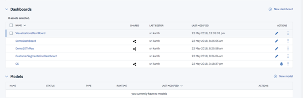
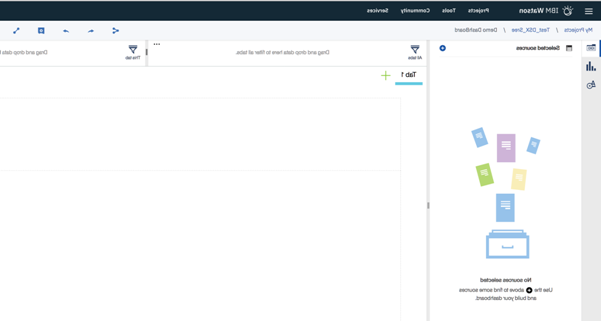

  
# Analytics driven Customer Behavior Ranking for Retail Promotions using POS data

> Analytics driven Customer Behavior Ranking for Retail Promotions using POS data  
Profile Customer based on their Buying behavior using POS(Point of Sale) data from a Retail stores.  
Normalised Behavior scores are computed based on their Shopping patterns and a Analytics Segmantation  
is run to identify Customers like Gold Class, Customers with Up Sell prospects or Customers at Risk and   
Dormant Customers. These Segments of Customers are then used for launching specific Promotions 
  
Segmentation of Customer is a necessary first step in any Retail environment that needs to enhance their Customer experience. Customer Segmentation can be done using Point of Sale (PoS) data in Retail. Point of Sale data is captured at the counter in every Retail outlet either in FMCG or CPG  

This Code pattern is a walkthrough of the steps involved in using this PoS data to Segment Customers based on their buying behavior. Segmentation techniques are used to Rank Customers. The ranked Customer data is further used to generate Dashboards that delivers insights on the Customer buying Metrics  
  
IBM cloud storage, Python notebooks in IBM Data science experience, IBM Cognos will be used to implement the above Use case  
  
All the intermediary steps are modularized and all code open sourced to enable developers to use / modify the modules / sub-modules as they see fit for their specific application  
  
When you have completed this pattern, you will understand how to
  
*	Read Retail Point of Sale (PoS) data stored in the IBM Object storage
*	Configure the features for Segmentation
* Run the Segmentation of Customers using Manual and Auto mode
* Run a Cognos dashboard to analyze the results of Customer segmentation and Buying insights of different Segments

#### Steps:
1.	User signs up for IBM Data Science experience
2.	User loads the sample IoT sensor Time series data to database
3.	A configuration file holds all the key parameters for running the IoT Time series prediction algorithm
4.	The prediction algorithm written in Python 2.0 Jupyter notebook uses the Configuration parameters and Sensor data from DB
5.	Python Notebook runs on Spark in IBM Watson Studio to ensure performance and scalability
6.  The outputs of the prediction algorithm is saved in Object storage for consumption

# Included Components

•	[IBM Cloud](https://console.bluemix.net/catalog/): IBM's innovative cloud computing platform or IBM Cloud in short (formerly Bluemix) combines platform as a service (PaaS) with infrastructure as a service (IaaS) and includes a rich catalog of cloud services that can be easily integrated with PaaS and IaaS to build business applications rapidly.
* [IBM Watson Studio](https://www.ibm.com/cloud/watson-studio): Analyze data using Python, Jupyter Notebook and RStudio in a configured, collaborative environment that includes IBM value-adds, such as managed Spark.
•	[IBM Data Science Experience](https://www.ibm.com/bs-en/marketplace/data-science-experience): Analyze data using Python, Jupyter Notebook and RStudio in a configured, collaborative environment that includes IBM value-adds, such as managed Spark.
* [IBM Cloud Object Storage](https://console.ng.bluemix.net/catalog/services/object-storage/?cm_sp=dw-bluemix-_-code-_-devcenter): An IBM Cloud service that provides an unstructured cloud data store to build and deliver cost effective apps and services with high reliability and fast speed to market.

# Featured Technologies

* [Analytics](https://developer.ibm.com/code/technologies/analytics?cm=IBMCode-_--_-featured_technologies-_-analytics): Finding patterns in data to derive information.
* [Data Science](https://developer.ibm.com/code/technologies/data-science?cm=IBMCode-_--_-featured_technologies-_-data-science):Systems and scientific methods to analyze structured and unstructured data in order to extract knowledge and insights.
* [IBM Cognos Live Embedded](https://console.bluemix.net/catalog/services/ibm-cognos-dashboard-embedded): The IBM Cognos Dashboard Embedded lets you, the developer, painlessly add end-to-end data visualization capabilities to your application so your users can easily drag and drop to quickly find valuable insight and create visualizations on their own.
It is a new, API-based solution that lets developers easily add end-to-end data visualization capabilities to their applications so users can create visualizations that feel like part of the app. 
It offers developers the ability to define the user workflow and control the options available to users – from a guided exploration of the analysis through authored fixed dashboards to a free-form analytic exploration environment in which end-users choose their own visualizations – and virtually anything in between. 
* [Cognos DashBoard Embedded](https://developer.ibm.com/code/2018/04/20/understand-data-cognos-dashboard-embedded/)
  
# Watch the Video  

# Steps

Follow these steps to setup and run this IBM Code Pattern. The steps are described in detail below.
1. [Sign up for the Watson Studio](#1-sign-up-for-watson-studio)
2. [Create IBM Cloud services](#2-create-ibm-cloud-services)
3. [Create the Jupyter notebook](#3-create-the-jupyter-notebook)
4. [Add the data and configuraton file](#4-add-the-data-and-configuration-file)
5. [Run the notebook](#5-run-the-notebook)
6. [View the Segmentation results](#6-view-the-segmentation-results)
7. [Run Cognos dashboard](#7-run-cognos-dashboard)
8. [Analyze Customer bahaviorinsights](#8-analyze-customer-behavior-insights)

## 1. Sign up for the Watson Studio

Sign up for IBM's [Watson Studio](https://www.ibm.com/cloud/watson-studio/). By signing up for Watson Studio, two services will be created - Spark and ObjectStore in your IBM Cloud account.  

  

IBM Cloud -> Launch
Catalog -> Watson -> Watson Studio
  
  

## 2. Create IBM Cloud services

### 2.1 Download sample data, configuration file, code  

Download the [sample data file](https://github.com/IBM/commerce_pos_analytics/blob/master/data/Online%20Retail%20Sample.csv), [sample configuration file](https://github.com/IBM/commerce_pos_analytics/blob/master/configuration/PromoConfig.txt), [python notebook](https://github.com/IBM/commerce_pos_analytics/blob/master/notebook/customer_segmentation_promo.ipynb) from github and store it in your a local folder. This will be used to upload to database in the next steps.

Once you are familiar with the entire flow of this Pattern, you can use your own data for analysis. But ensure that your data format is exactly same as provided in the sample data file and configuration file.
  
## 3. Create the Jupyter notebook

First create a new project in Watson Studio. Follow the detailed steps provided in the [IBM online documentation for Watson Studio Project creation](https://datascience.ibm.com/docs/content/analyze-data/creating-notebooks.html), or watch a video on using [Watson Studio to create a project](https://youtu.be/QSttEjcHtl0).

In [Watson Studio](http://dataplatform.ibm.com/):

Use the menu on the top to select `Projects` and then `Default Project`. 
Click on `Add notebooks` (upper right) to create a notebook.

* Select the `From URL` tab.
* Enter a name for the notebook.
* Optionally, enter a description for the notebook.
* Enter this Notebook URL:
https://github.com/IBM/commerce_pos_analytics/blob/master/notebook/customer_segmentation_promo.ipynb
* Select the free Anaconda runtime.
* Click the `Create` button.
* Upload the sample .json, .txt Watson Studio configuration file to Watson Studio Object storage from URL below:  
    "https://github.com/IBM/commerce_pos_analytics/blob/master/data/Online%20Retail%20Sample.csv"  
    https://github.com/IBM/commerce_pos_analytics/blob/master/configuration/PromoConfig.txt  

  To upload these files in Watson Studio object storage, 
   * Go to `My Projects` -> `Your Project Name`
   * Click on the ``Find and add data`` icon on top ribbon
   * Select the file and upload one by one  

     
  
  Now you must be able to see the uploaded files listed under `My Projects` -> `Your Project Name` -> `Assets`  tab  
  
  
## 4. Add the data and configuraton file
Fix-up configuration parameter .json file name and values:

Go to the Notebook in Watson Studio by navigating to `My Projects` -> `IoT Predictive`
Under ``Assets`` tab, under ``Notebooks`` section you will find the Notebook you just imported
Click on the ``Click to Edit and Lock`` icon to edit the notebook in Jupyter notebook in Watson Studio  

For more details on Creating, Editing and sharing notebooks in IBM Watson Studio refer to [Notebooks Watson Studio documentation](https://datascience.ibm.com/docs/content/analyze-data/notebooks-parent.html)

You can now update the variables that refer to the .txt configuration file name in the Python - Jupyter Notebook.
This step is necessary only if you had changed the name of the sample .json configuration file you had uploaded earlier for any reason.  

  

The default .txt configuration file, you uploaded earlier works without any changes with the Sample data supplied.

If you wanted to customise the Segmentation model to suit your requirements you can do so. Below are the steps to configure the .json configuration file to train the Predictive models using your custom data file.

1. Download the [.txt configuration file](https://github.com/IBM/commerce_pos_analytics/blob/master/configuration/PromoConfig.txt) to your Computer local folder  
2. Open a local copy of the .txt file in text editor like notepad and edit the [Watson Studio configuration .json file](https://github.com/IBM/commerce_pos_analytics/blob/master/configuration/PromoConfig.txt)
3. 3.	Update the ``column values`` to suit your requirements and save the PromoConfig.txt file. Retain the rest of the format and composition of the .txt file
4. Delete the copy of `PromoConfig.txt` in Watson Studio data store if one is already uploaded by you earlier.  
5. Now upload your local edited copy of `PromoConfig.txt` by following the steps in section 6.3 above.  
    

    
The descriptions of the columns that can be configured are as below.  

i. Customer Segment: Name of the Customer segement tobe assigned  
ii. Segment Auto Rank: Corresponding Ranking for the Customer segment. Used only if the Customer segmentation is run as AUTO  
iii. RFrom, RTo: Range of Recency value in dates. This is a numeric field with range from 0-100. Used only if the Customer segmentation mode is run as MANUAL  
iv. FFrom, FTo: Range of Frequency value in dates. This is a numeric field with range from 0-100. Used only if the Customer segmentation mode is run as MANUAL  
v.MFrom, MTo: Range of Shopping value. This is a numeric field with range from 0-100. Used only if the Customer segmentation mode is run as MANUAL  

* The cell 3.1.2 of the Jupyter Notebook has a function definition which is shown for illustration purposes.  
These details that have user specific security details are striked out in the screenshots shown below.  
This function will need to be recreated with your user specific access credentials ang target data object.  
In order to do that first delete all pre existing code in cell 3.1.2 of the notebook.  
  
Note: The .pynb file that you imported have code with dummy credentials for illustration purposes.  
This needs to be replaced by your user specific function with your own access credentials.  
The steps below explain that.  
  

* In section 3.1.2 of Jupyter Notebook (not this README file), Insert (replace) your own Object storage file credentials to read the `PromoConfig.txt` configuration file  
  
  

* This step will auto generate a function that reads the data followed by a call to the function as below:  

Refer to screen shot above for details.  
For more details, revisit the documentation help links provided in beginning of section 5.2.2  

#### Add the data and configuration to the notebook

Use ``Find and Add Data`` (look for the ``10/01`` icon) and its ``Connections`` tab. You must be able to see your database connection created earlier. From there you can click ``Insert to Code`` under the `Data connection` list and add ibm DBR code with connection credentials to the flow.

Note: If you don't have your own data and configuration files, you can reuse our example in the `Read IoT Sensor data from database` section. Look in the `/data/iot_sensor_dataset.csv` directory for data file.

  
The Customer segmentation can be run in 2 modes  
  
1.	By setting the mode to “AUTO” 

In AUTO mode Customer segmentation algorithm will automatically do the segmentation and ranking based on Customer Buying behavior     
  
2.	By setting the mode to “MANUAL”  

In MANUAL mode, the range of values mentioned for Customer metrics will be used for applying the segmentation.  
  

## 5. Run the notebook
When a notebook is executed, what is actually happening is that each code cell in
the notebook is executed, in order, from top to bottom.

Each code cell is selectable and is preceded by a tag in the left margin. The tag
format is `In [x]:`. Depending on the state of the notebook, the `x` can be:

* A blank, this indicates that the cell has never been executed.
* A number, this number represents the relative order this code step was executed.
* A `*`, this indicates that the cell is currently executing.

There are several ways to execute the code cells in your notebook:

* One cell at a time.
  * Select the cell, and then press the `Play` button in the toolbar.
* Batch mode, in sequential order.
  * From the `Cell` menu bar, there are several options available. For example, you
    can `Run All` cells in your notebook, or you can `Run All Below`, that will
    start executing from the first cell under the currently selected cell, and then
    continue executing all cells that follow.
* At a scheduled time.
  * Press the `Schedule` button located in the top right section of your notebook
    panel. Here you can schedule your notebook to be executed once at some future
    time, or repeatedly at your specified interval.

## 6. View the Customer segmentation results

The notebook outputs the results in the Notebook which can be copied to clipboard
Results for AUTO Customer segmentation  
  
  

If you are satisfied with the Automatic segmentation results, you can proceed further for runningthe Cognos Dashboard and analyze the insights  

If you wanted to further tweak and improve the results, you can update the config text file and run the Customer segmentation in manual mode  
Results for MANUAL Customer segmentation  
  
  

## 7. Dashboard for Customer Segment Visualization
  
Understanding data effectively can be tricky. With too little data, any kind of analysis is unreliable. But too much data can make it difficult to understand exactly what you’re looking at. These days, very few people suffer from too little data, but too much data is a common problem in the age of big data. 
The [Cognos Dashboard Embedded](https://developer.ibm.com/data/cognos-dashboard/), a new service offered on IBM Cloud, lets developers easily add end-to-end data visualization capabilities to their applications so users can create visualizations that feel like part of the app.
  
### 7.1 Steps to Create the Visualizations:    
As explained in the beginning of this Code Pattern you must have completed the below steps  
1. Watson Studio & Create the Service  
2. Watson Studio instance  
3. Craete a New Project in Watson Project  

STEP 4: See for the output of the file loaded to datasets tab as part of the model execution process (see previous sections)
If you don’t see the data file which is in csv format then,
Add a csv file to the Project space which eventually will be added to the Datasets.

  
  
STEP 5: From the Dashboard tab add a new dashboard:  

  
  
As you are creating the dashboard for the first time, you will need to create Cognos Dashboard service.  

  
  
STEP 6: Add a source as the .csv file from the recently uploaded dataset:  

  
  
See available csv files. Pick the ones which your model has uploaded to Cloud Storage space given to you.  
Click on the Segmented Customers csv file:  

  
  
STEP 6: Now, you can drag and drop the required fields to the Dashboard area.  

  
  
Also, you can create your own Calculations.  

  
  
  
  
STEP 7: View Cognos dashboard:  
  
  

STEP 8: Finally Share the output - Once you are done with building the simple and easy dashboard, you can share as an URL which you can plug into your any application.  
  
  
[Sample Dashboard for Customer Segmentataion](https://dataplatform.ibm.com/dashboards/88588f96-ce99-4483-b6ea-e6692d621307/view/7723bc0138e229ed74d2f2e407cf2f0e2b362c5db2bbd60288d07b4906362397a83f4191c828185ddf155765f4bf470dcb)
  
# Troubleshooting

[See DEBUGGING.md](DEBUGGING.md)
  
# License

[Apache 2.0](LICENSE)

